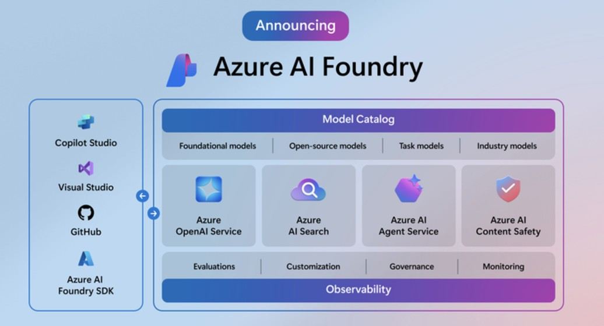

# AI Foundry Sample
Please refer to the official guideline below for building this sample project, you may refer to the requirements.txt if you have any problems.

[Set up project and development environment to build a custom knowledge retrieval (RAG) app with the Azure AI Foundry SDK](https://learn.microsoft.com/en-us/azure/ai-studio/tutorials/copilot-sdk-create-resources?)

[Build a custom knowledge retrieval (RAG) app with the Azure AI Foundry SDK](https://learn.microsoft.com/en-us/azure/ai-studio/tutorials/copilot-sdk-build-rag)

[Evaluate a custom chat application with the Azure AI Foundry SDK](https://learn.microsoft.com/en-us/azure/ai-studio/tutorials/copilot-sdk-evaluate)

